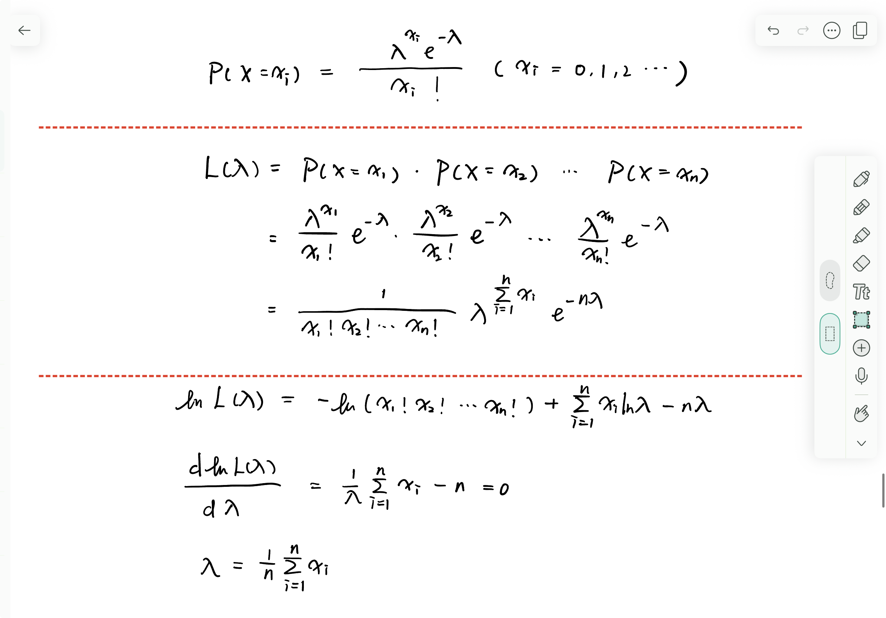

# BCI decoding
## Project Overview
This project is based on primate motor cortex data and implements two types of brain-computer interface (BCI) neural prosthetic decoders: a linear filter for real-time reconstruction of movement trajectories, and a Bayesian classifier focused on accurately identifying movement targets. These decoders are designed for different use scenarios in neural prosthetics. The continuous decoder is well suited for applications that require reproducing the full course of motion, such as continuous control of robotic arms, where every point along the trajectory matters for natural, smooth operation. In contrast, the discrete decoder is optimal for goal-directed tasks—such as typing where the priority is determining the intended final destination rather than tracking the intermediate path.

## Linear filter
Goal: Use a linear regression model to reconstruct hand movement trajectories from neural firing activity.

To compute the linear filter coefficients, the continuous decoder applies a linear model in the form Y = XA, where Y represents the two-dimensional hand positions, X is the matrix of neural firing rates (with an additional column of ones appended for the offset), and A denotes the coefficients to be estimated. Since there is a physiological delay between neural activity and behavior, we need to shift the Y matrix backward by two time steps (equivalent to 140 ms) to better align the neural and kinematic data. After fitting the model on the training set, hand trajectories can be reconstructed from neural data and the coefficient matrix A, then plot both the actual and predicted hand trajectories for visual inspection. The reconstruction accuracy is quantitatively assessed using the mean squared error (MSE). For generalization testing, the coefficient matrix A obtained from the training set is used to predict hand trajectories in a separate test set.

## Bayesian classifier
Goal: Predict the endpoint target of a reach based on neuronal spike counts.

The discrete decoder is designed to determine which predefined target is most likely associated with the current pattern of neural activity. This method assumes that, for each neuron-target pair, the spike count is well described by a Poisson distribution. During the training phase, the Poisson parameter λ, representing the expected spike count, is estimated for each neuron-target pair using maximum likelihood estimation (MLE); under the Poisson assumption, the MLE for λ is simply the average observed spike count across repeated trials for a specific neuron and target, resulting in a matrix of λ values that effectively serves as a neural “fingerprint” for each target. To evaluate model performance, this study employs leave-one-out cross-validation (LOOCV): for each evaluation, a single trial is set aside as the test set, and the decoder is trained using all remaining trials. During decoding, the observed spike count vector from the left-out trial is compared to all target-specific λ vectors using the maximum likelihood principle; the target whose mean firing pattern is most likely to have produced the observed activity is selected.

